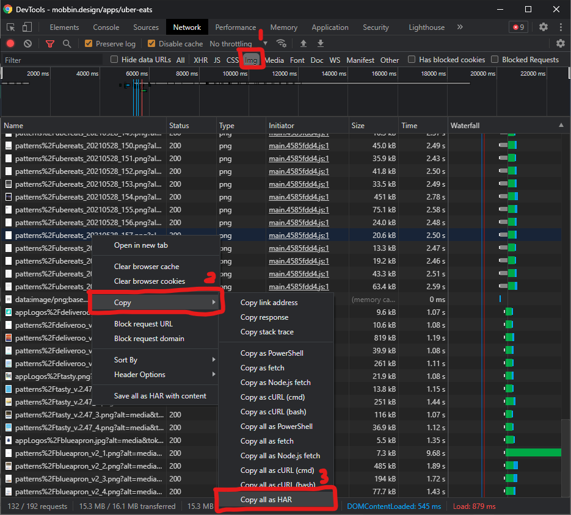

Mobbin Scrapper
===

Tutorial
---
1. You need to open the mobbin.design page you want to scrap  
  e.g. https://mobbin.design/apps/uber-eats
2. Open Chrome / Any Other Dev Tools  
3. Go to Network Tab > Filter Img (Optional) > Copy > Copy all as HAR  
  *Note: Image filtering is set inplace in the code*



4. Create har.json file in current directory
5. Paste the har content to the file
6. Install all dependencies
  ```bash
  pip install -r requirements.txt
  ```
7. Run this command  
  ```bash
  python main.py
  ```
8. The file is ready to use in the `downloaded_img` folder

---

OLD
===

Rename Commands
---
- rename 's/.alt.*//g' *
- rename 's/^.*F//g' *

Links
---
- Regex Test  
  https://regex101.com/
- Magic JS to download IMG  
  https://gist.github.com/tobek/a17fa9101d7e28ddad26
- Rename batch  
  https://ostechnix.com/how-to-rename-multiple-files-at-once-in-linux/